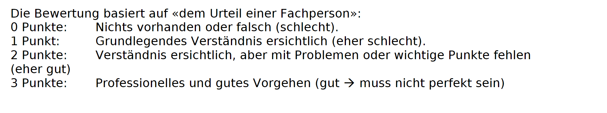

# Übersicht

## Teil 1

- App Aufbau (ohne Code)
- Transaktion Theorie
- Teamaufbau
- Git und Projektsetup -> Readme und commit gemacht

## Teil 2

- Backend
  - Db Setup (Migration, Seeding etc)
  - Rollenmanagement
- Frontend

## Teil 3

- Konfliktsituation
- Projektarbeit

## Teil 4

- Projektarbeit
- Komponenten bauen

## Teil 5

- Projektarbeit

# Bewertungskriterien

|Kriterium |Die Applikation stellt alle Funktionen gemäss Fallbeschreibung zur Verfügung.|Der Aufbau der Applikation macht Sinn und ist professionell.|Die Massnahmen sind konkret beschrieben, belegt und machen Sinn.|Die Unittests sind korrekt implementiert und funktionieren.|Die Lasttests sind korrekt implementiert funktionieren.|Es wird an einem Beispiel plausibel gezeigt, dass die Unit- oder Lasttests funktionieren.|Es wurde eine weitere Funktionalität im Backend implementiert|Es wurde eine weitere Funktionalität im Frontend implementiert|Die neue Funktionalität wurde Unit Getestet|Es wurde eine weitere Funktionalität im Backend implementiert|Es wurde eine weitere Funktionalität im Frontend implementiert|
|----------|-----------------------------------------------------------------------------|------------------------------------------------------------|----------------------------------------------------------------|-----------------------------------------------------------|-------------------------------------------------------|-----------------------------------------------------------------------------------------|-------------------------------------------------------------|--------------------------------------------------------------|-------------------------------------------|-------------------------------------------------------------|--------------------------------------------------------------|
|Max Punkte|3                                                                            |3                                                           |3                                                               |3                                                          |3                                                      |3                                                                                        |3                                                            |3                                                             |3                                          |3                                                            |3                                                             |

| Note | Punkte |
| ---- | ------ |
| 6.0  | 31-33  |
| 5.5  | 29-30  |
| 5.0  | 27-28  |
| 4.5  | 25-26  |
| 4.0  | 22-24  |

